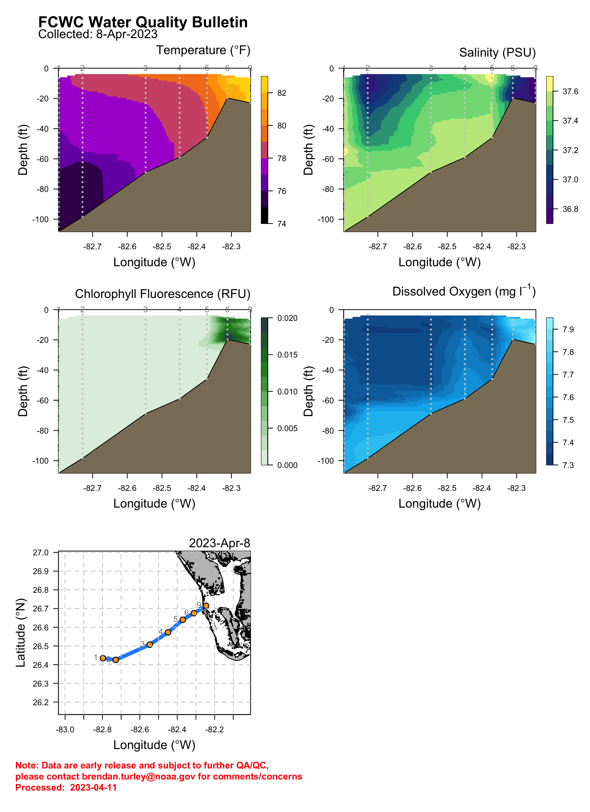

## Most Recent Data

-----

### Click **[here](previous_v2.html)** for previous bulletins.

### Explore FCWC data **[here](https://oceandata.shinyapps.io/fcwc-data-explorer/)**.

### Find out more about this project **[here](about.html)**.

-----

### Click to [report an issue](https://docs.google.com/forms/d/e/1FAIpQLSf2F628Zew_N-vfUUy7mg5wJhs626IRFVibEHY1nBV1fwTvig/viewform?usp=sf_link)

-----