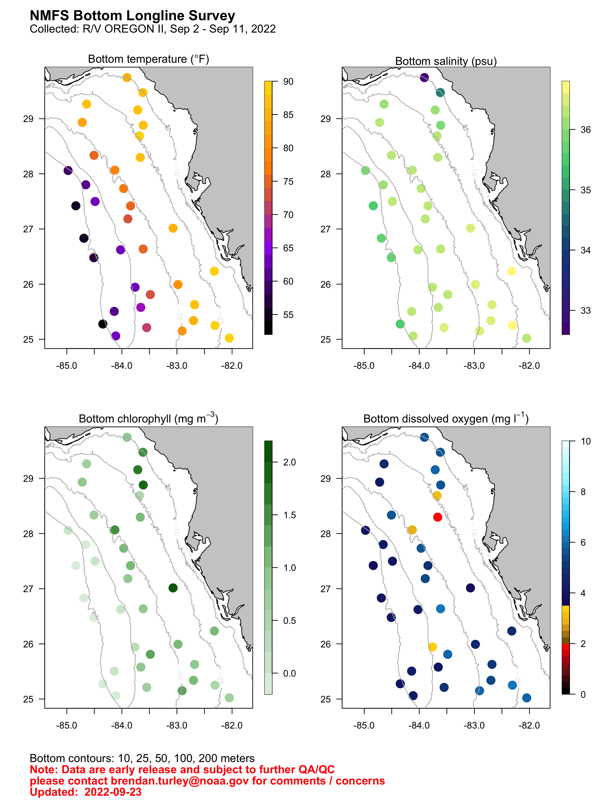

## Most Recent Data

-----

# **[Previous data](previous_data.html)**

## **[FCWC data explorer](https://oceandata.shinyapps.io/fcwc-data-explorer/)**

## **[About](about.html)**

-----
### [Report an issue](https://github.com/Gulf-IEA/WFS_bulletins/issues/new?assignees=bdturley&labels=User+supplied+issue&template=comment---concern---question---observation.md&title=User+supplied+issue)
-----